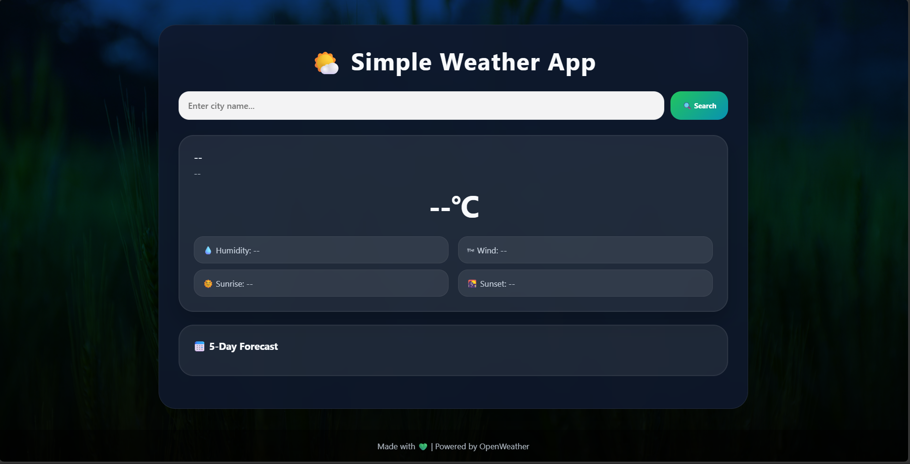
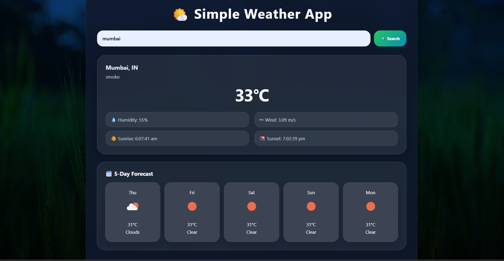

# 🌦️ Simple Weather Web

A clean and modern weather application that provides real-time weather information and a 5-day forecast for any city.

I created this project while learning API setup using JavaScript.

---

## 📸 Preview




---

## 🚀 Live Demo

[Click Here to Open](https://aditya-star-0.github.io/Simple-Weather-Web/)

---

## ✨ Features

- Real-time weather information
- 5-day weather forecast
- Humidity, wind speed, sunrise & sunset
- Responsive design
- Modern glassmorphism UI
- Works on desktop and mobile devices

---

## 🛠️ Technologies Used

- HTML5
- CSS3
- JavaScript
- OpenWeather API

---

## ⚙️ Setup Instructions

### 1️⃣ Clone Repository

```bash
git clone https://github.com/Aditya-star-0/Simple-Weather-Web.git
```

### 2️⃣ Open Project Folder

```bash
cd Simple-Weather-Web
```

### 3️⃣ Add API Key

Open `script.js` and replace:

```javascript
const apiKey = "YOUR_API_KEY";
```

with your OpenWeather API key.

Get your free API key from:
https://openweathermap.org/api

### 4️⃣ Run the Project

Open `index.html` in your browser.

---

## 📂 Project Structure

```bash
Simple-Weather-App/
│
├── index.html
├── style.css
├── script.js
└── images/
    └── page_1.png
    └── page_2.png
```

---

## 🌐 Browser Support

- Chrome
- Firefox
- Edge
- Safari

---

## 🤝 Contributing

Contributions are welcome. Feel free to fork this repository and improve the project.

---

## 📜 License

This project is licensed under the MIT License.